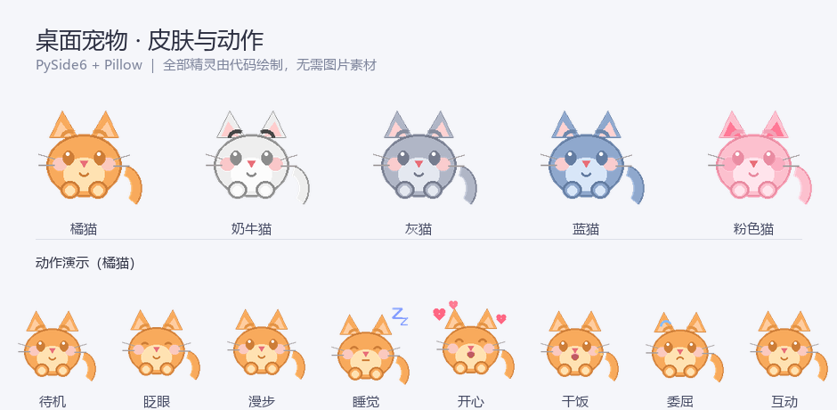

# 桌面宠物 🐱

一只住在你桌面上的小猫咪。会待机、会漫步、会饿、会困、会撒娇，还会定时给你讲一句好话。

**全部精灵图像由代码绘制**（Pillow），不依赖任何图片素材，5 种皮肤 × 9 种动作随时可扩展。



## ✨ 功能特性

**宠物本体**
- 5 种皮肤：橘猫、奶牛猫、灰猫、蓝猫、粉粉猫（以及可选的网络动漫头像）
- 9 种动作：待机呼吸、眨眼、漫步、睡觉、干饭、开心、委屈等
- 三围系统：饱腹度 / 心情 / 体力随时间变化，饿了会委屈、体力耗尽会自动睡觉
- 会说随机台词，气泡自动换行，长句也能完整显示

**交互方式**

| 操作 | 效果 |
| --- | --- |
| 左键单击 | 抚摸（心情 +8） |
| 左键双击 | 睡觉 / 起床 |
| 按住拖动 | 移动到任意位置（支持多显示器） |
| 右键 | 呼出功能菜单 |
| 托盘图标双击 | 打开控制面板 |

**控制面板**（可滚动深色界面）
- 互动、三围状态条、改名、换肤、大小/速度/说话频率调节
- 自动走动、窗口置顶、提示音、开机自启开关
- 所有设置**改动即自动保存**（防抖 600ms 落盘）

**网络小功能**（异步请求，不阻塞界面）

| 功能 | 数据来源 |
| --- | --- |
| 💬 每日一言 / 📜 每日诗词 / 💘 沙雕语录 | [hitokoto 一言](https://hitokoto.cn/) |
| 🌏 60秒看世界 | [60s.viki.moe](https://60s.viki.moe/) |
| 🌤 今日天气（可改城市） | [Open-Meteo](https://open-meteo.com/) |
| 🎨 随机动漫头像 | [dmoe.cc](https://www.dmoe.cc/) / [mwm.moe](https://t.mwm.moe/) |

## 🚀 快速开始

**环境要求**：Windows 10/11，Python 3.10 或更高（开发环境为 3.14）

```bash
# 1. 获取代码
git clone https://gitee.com/noME-LJZ-back/desktop-pet.git
cd desktop-pet

# 2. 安装依赖
pip install -r requirements.txt

# 3. 运行
python main.py
```

想直接下压缩包也可以：[Gitee 下载](https://gitee.com/noME-LJZ-back/desktop-pet/repository/archive/main.zip)

想要不弹出黑色控制台窗口，用 `pythonw main.py` 启动。

## 📁 数据存放位置

程序不往代码目录里写任何东西：

| 运行方式 | 配置与缓存位置 |
| --- | --- |
| 源码运行 | 项目根目录（`pet_config.json` 等，已加入 .gitignore） |
| 打包成 exe 后 | `%APPDATA%\桌面宠物\` |

`pet_config.json` 保存全部设置，`pet_state.json` 保存宠物三围，`assets/` 存放自动生成的音效和头像缓存。删掉它们即可恢复出厂状态。

> 注意：`pet_config.json` 属于个人数据，**不要提交到公开仓库**。

## 📦 打包成 exe / 安装程序（可选）

仓库里已经带好了完整的打包脚本，需要时执行：

```bash
# 1. 生成程序图标（多尺寸 ico，从猫咪精灵绘制而来）
python make_icon.py

# 2. 打包成独立 exe（onedir 模式，产物在 dist/DesktopPet）
python -m PyInstaller --noconfirm --clean packaging/desktop_pet.spec

# 3. 生成安装程序（需要安装 Inno Setup 6，产物在 installer/）
"%ProgramFiles(x86)%\Inno Setup 6\ISCC.exe" packaging/desktop_pet_installer.iss
```

> 分发打包好的程序时请注意：PySide6 使用 **LGPLv3** 许可，动态链接分发需随附相应许可文本并允许用户替换该库。

## 🗂 项目结构

```
├── main.py                         # 程序入口、单实例锁、托盘装配
├── make_icon.py                    # 从猫咪精灵生成多尺寸程序图标
├── requirements.txt
├── docs/preview.png                # README 预览图
├── packaging/                      # 打包相关（可选）
│   ├── desktop_pet.spec            # PyInstaller 配置
│   ├── desktop_pet_installer.iss   # Inno Setup 安装脚本
│   ├── app.ico                     # 程序图标
│   └── ChineseSimplified.isl       # Inno Setup 简体中文语言包
└── pet_desktop/
    ├── sprites.py                  # 核心：用 Pillow 绘制全部猫咪精灵
    ├── pet_window.py               # 透明置顶窗口、状态机、交互
    ├── panel.py                    # 可滚动控制面板（QSS 深色主题）
    ├── api.py                      # 网络功能（异步，不阻塞界面）
    ├── dialogs.py                  # 长文本弹窗（快讯等）
    ├── audio.py                    # 程序内合成音效（无需音频素材）
    ├── config.py                   # 配置持久化、开机自启
    └── tray.py                     # 系统托盘
```

## 🎨 想加自己的皮肤？

打开 `pet_desktop/sprites.py`，在 `SKINS` 字典里加一组配色即可，无需任何图片素材：

```python
"我的猫": {
    "body": (200, 180, 255), "dark": (150, 130, 200), "belly": (240, 235, 255),
    "stripe": (180, 160, 235), "cheek": (255, 210, 210), "blush": (255, 170, 170, 140),
},
```

面板的皮肤下拉框会自动出现新选项。

## ❓ 常见问题

**Q：宠物不见了？**
看系统托盘区，双击图标打开控制面板，或右键菜单里的「显示/隐藏宠物」。

**Q：换头像 / 看快讯没反应？**
这些功能依赖上面列出的第三方公开接口，接口限流或维护时会失败，程序只会说一句「网络开了个小差」。把自动刷新的间隔调长一些可以降低被限流的概率。

**Q：开机自启改了什么？**
开启后会在注册表 `HKCU\Software\Microsoft\Windows\CurrentVersion\Run` 写入一条启动项；关闭时会删除。介意的话不要开启即可。

**Q：想恢复默认设置？**
删除数据目录下的 `pet_config.json` 和 `pet_state.json`，或使用控制面板里的「重置数据」。

## ⚠️ 免责声明

- 本项目调用的新闻、一言、天气、动漫头像等接口均为**第三方免费公开服务**，本项目不对其内容、可用性和准确性负责。接口可能随时变更或停止服务。
- 「动漫头像」功能仅从第三方图站获取随机图片并在用户本地缓存，本项目不存储、不传播这些图片，图片版权归原作者所有。请在遵守当地法律法规和相关服务条款的前提下使用。
- 请勿将本项目用于任何违法用途。

## 📄 开源协议

[MIT License](LICENSE) — 可自由使用、修改、分发，包括商业用途，只需保留版权声明。

## 🙏 致谢

- [PySide6](https://www.qt.io/qt-for-python) — Qt 的 Python 绑定
- [Pillow](https://python-pillow.org/) — 图像绘制
- [Inno Setup](https://jrsoftware.org/isinfo.php) 及其中文语言包维护者 Zhenghan Yang
- 所有提供免费公开接口的服务方
